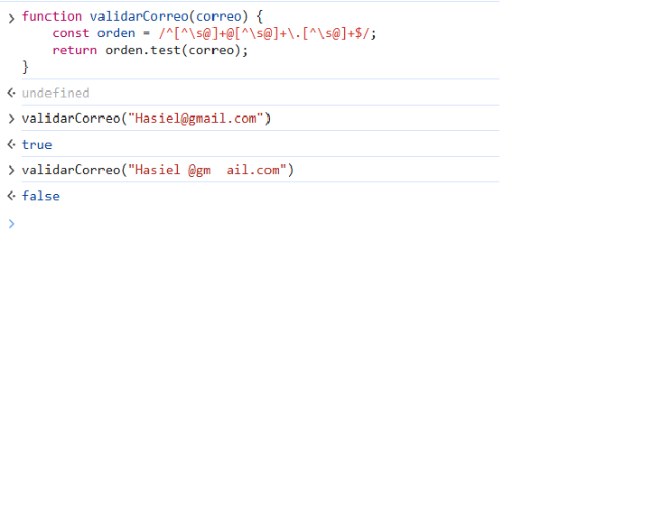
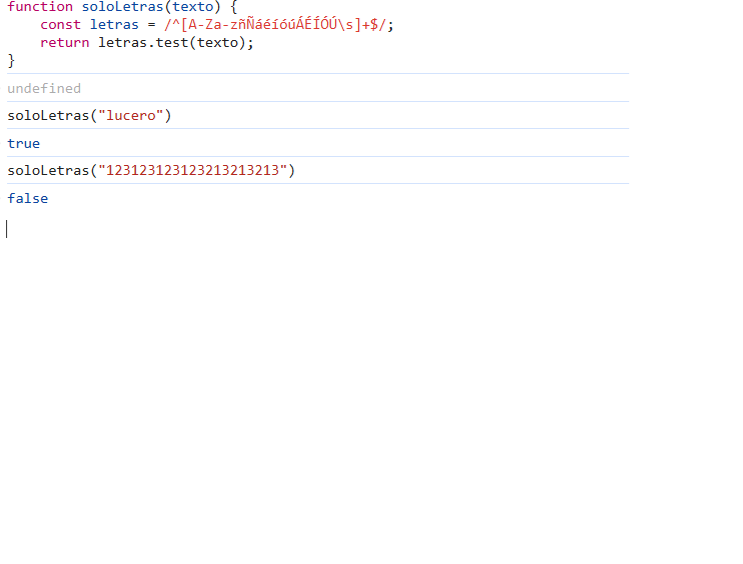
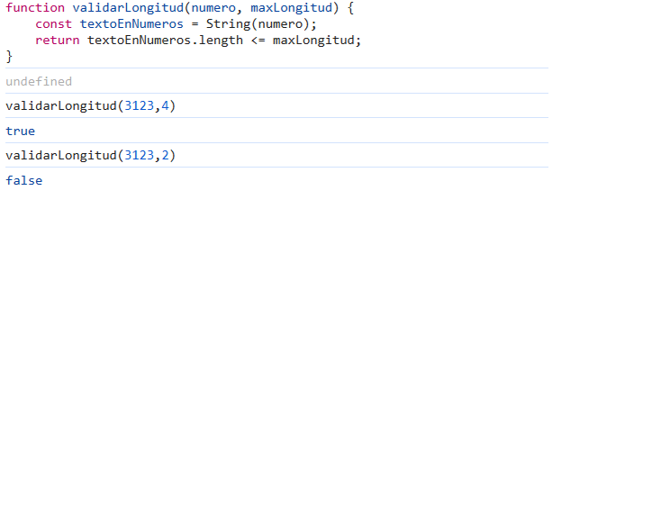
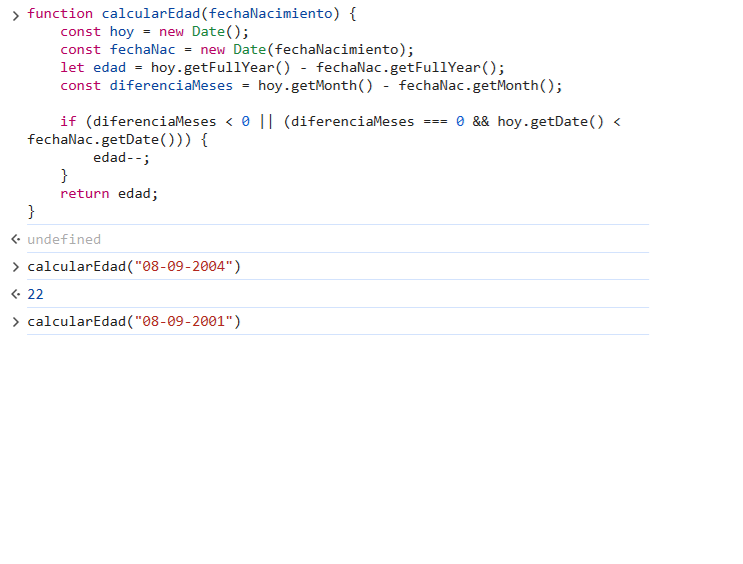
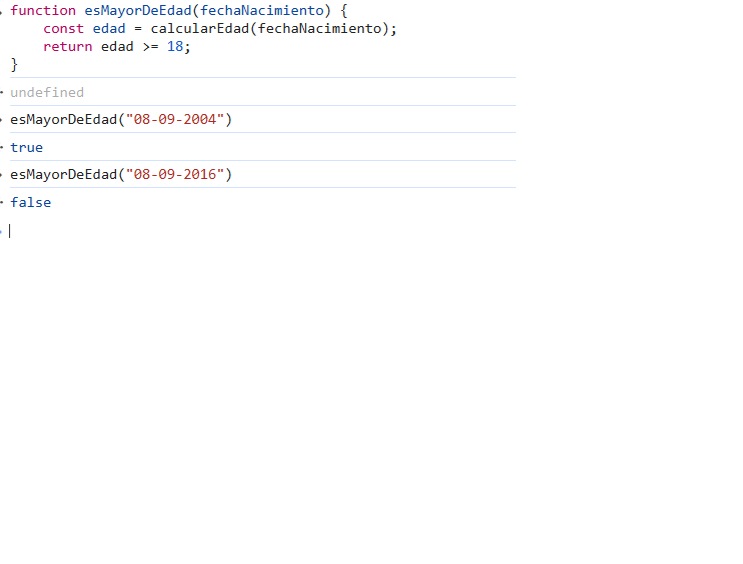
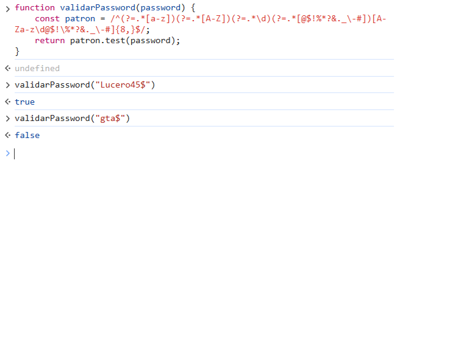

# 🛠️ Utileria.js - Librería de Validaciones y Formato JS

**Autor:** Hasiel Isai Mendoza Lucero  
**Materia:** Programación Web  
**Maestra:** ADELINA MARTINEZ  

---

## 📌 ¿Qué problema resuelve?
**Utileria.js** es una librería ligera en Javascript puro (Vanilla JS) sin dependencias ni frameworks. Resuelve la necesidad recurrente de validar datos de entrada en formularios de registro e inicio de sesión (correos, contraseñas seguras, solo letras, edades y longitudes) y ofrece funciones de utilidad para dar formato a textos e identificadores únicos.

---

## 🚀 Instalación

Incluye el archivo `utileria.js` en tu proyecto HTML antes de tus scripts principales:

```html
<script src="js/utileria.js"></script>

Uso e Integración
1. Funciones Obligatorias
validarCorreo(correo)
Valida si una cadena cumple con la estructura estándar de correo electrónico (usuario@dominio.com).

console.log(validarCorreo("usuario@ejemplo.com")); // true
console.log(validarCorreo("correo_invalido"));     // false

soloLetras(texto)
Comprueba que el texto contenga únicamente letras (mayúsculas/minúsculas), acentos y espacios.


console.log(soloLetras("Mendoza Lucero")); // true
console.log(soloLetras("Usuario123"));     // false

validarLongitud(numero, maxLongitud)
Verifica que la representación numérica no exceda la longitud permitida.


console.log(validarLongitud("9511234567", 10)); // true
console.log(validarLongitud("123456789012", 10)); // false

calcularEdad(fechaNacimiento)
Calcula la edad actual en años cumplidos desde una fecha dada (YYYY-MM-DD).


console.log(calcularEdad("2000-05-15")); // Retorna la edad exacta en números enteros

esMayorDeEdad(fechaNacimiento)
Determina si la persona tiene 18 años o más.


console.log(esMayorDeEdad("2002-10-10")); // true
console.log(esMayorDeEdad("2010-01-01")); // false

validarPassword(password)
Valida que la contraseña cumpla con: mínimo 8 caracteres, 1 mayúscula, 1 minúscula, 1 número y 1 carácter especial.

console.log(validarPassword("ClaveSegura#2024")); // true
console.log(validarPassword("123456"));           // false

(Funciones Propias)
capitalizarTexto(texto)
Convierte la primera letra de un texto en mayúscula y el resto en minúsculas.


console.log(capitalizarTexto("mendoza lucero")); // "Mendoza lucero"

generarIdentificador(nombre, correo, password, fechaNacimiento)
Genera un ID único combinando iniciales de los datos del usuario y su año de nacimiento.

console.log(generarIdentificador("Hasiel", "test@mail.com", "Secret123!", "2000-01-01")); 
// Resultado: "ID-HTS-2000"

##  Capturas de Pantalla (Demostración de Funciones)

### Validación de Correo Electrónico


### Solo Letras


### Validar Longitud


### Calcular Edad


### Es Mayor de Edad


### Validar Password

